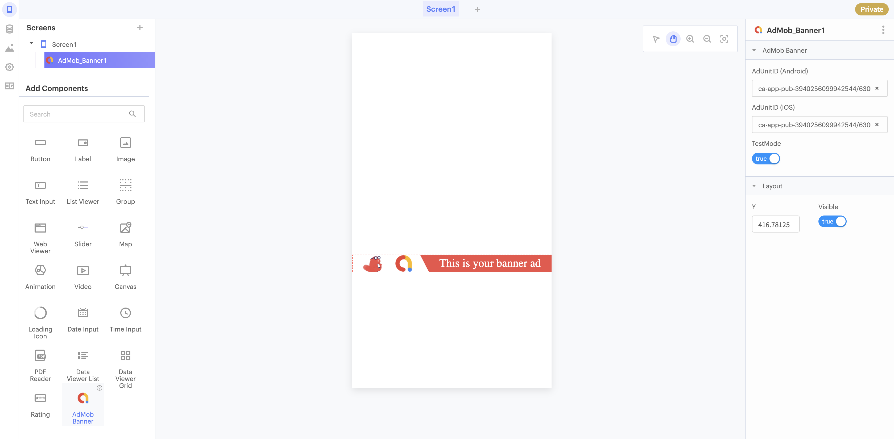
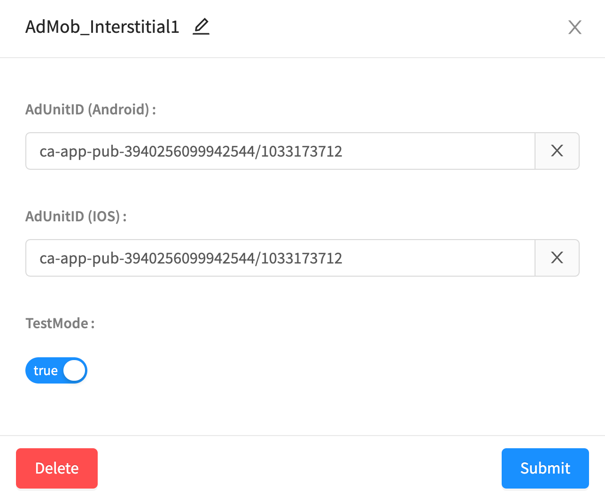
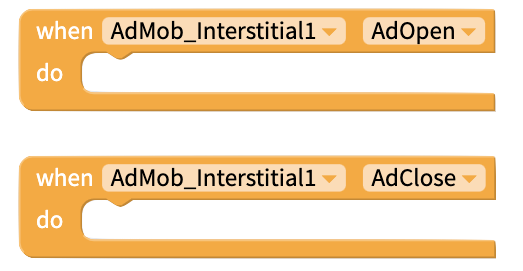
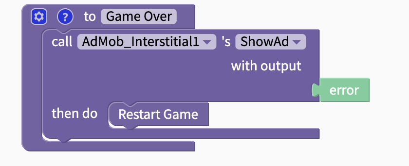
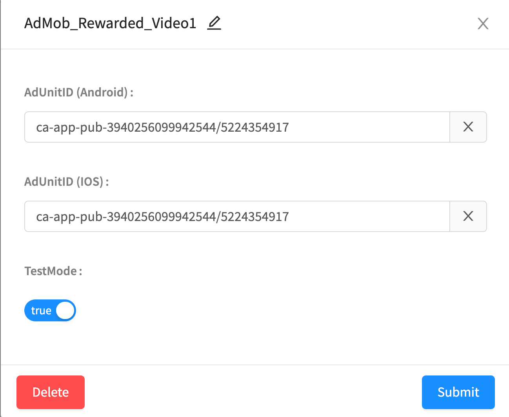
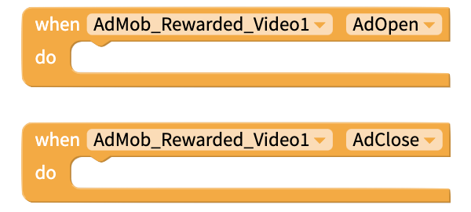

# Ads by AdMob

## AdMob Overview 


We highly recommend that you only add ads to your app after you have a large audience of users \(otherwise, you won't generate much revenue anyway\).


* [Review guidelines](admob.md#review-guidelines)
* [Ad formats](admob.md#ad-formats)
* [Interstitial ad](admob.md#interstitial-ad)
* [Rewarded video ad](admob.md#rewarded-video-ad)
* [Live test](admob.md#live-test)
* [Download and publish](admob.md#download-and-publish)  ****
  * [Submit for review](admob.md#submit-for-review)
  * [Create `Ad Unit ID`](admob.md#create-an-ad-unit-id)\`\`
  * [Link `Ad Unit ID`](admob.md#link-ad-unit-id)\`\`
  * [Set `test mode = false`](admob.md#set-test-mode-false)\`\`
* [Troubleshooting](admob.md#troubleshooting)

AdMob is the most popular ad network for monetizing mobile apps today. Apps with large audiences can use AdMob to not only generate revenue for the creator but in some cases \(like with AdMob Rewarded Video\), create better user experiences than the alternative \(e.g. in-app purchases to play a new game level\). 


**AdMob is a**   **component.** While all Thunkers can add AdMob to their app projects and live test the ads in their apps, only PRO Thunkers can download and publish apps with AdMob.

All apps must be approved by Thunkable subject to our [review guidelines](admob.md#review-guidelines). If you are a PRO Thunker, you can [**submit your app for review here**](https://docs.google.com/forms/d/e/1FAIpQLSf3DSZ_Uon406Demqt_pxJb1fiQRc6IT49CYf19bJr8VG40SQ/viewform). Once approved, apps can be downloaded and published without further review.

Thunkable reserves the right to change an app's approval status subject to any violation of our guidelines.

Thunkable also reserves the right to charge up to a 10% maintenance fee for revenue earned via AdMob in the future. 


## Review Guidelines

Thunkable has partnered with AdMob to ensure that apps created on our cross-platform use ads to monetize apps in a way that both provides high quality traffic to advertisers and a high quality user experience for end users of apps.

All apps with AdMob must be first approved by Thunkable before they can be downloaded or published. AdMob has its [own policies](https://support.google.com/admob/answer/7313578) that an app must comply with including but not limited to: 

* Inappropriate content that advertisers do not want to be associated with e.g. copyrighted, adult
* Invalid activity that lowers the quality of traffic to advertisers e.g. ad placements that encourage clicks

Thunkable will review apps for compliance with AdMob policies but will specifically **reject apps** that are:

* Incomplete apps - apps that are still in their early stages and won't show how ads will be used in the app
* Earning apps - apps that encourage users to clicks ads in exchange for some form of payment
* Auto-impression apps  - apps that repeatedly load banner ads in the background of apps

Once approved, apps can be downloaded and published without further review.

**Thunkable reserves the right to change an app's approval status subject to any violation of our guidelines.**

## Ad Formats

|  | **Banner ad** | Interstitial ad | Rewarded video ad |
| :--- | :--- | :--- | :--- |
| Description | Rectangular image or text ads that occupy a spot within an app's layout. Stays on screen while users interact with the app. Refreshes every minute. Good for beginners. | Full-screen ads that cover the interface of their host app. Typically displayed at natural transition points in the flow of an app, eg. between activities, between levels in a game. The user can click on or close the ad. | Full-screen video ads that users have the option of watching in full [in exchange for in-app rewards](https://support.google.com/admob/answer/7313578).  |
| Recommended for | Single-screen apps | Multi-screen apps | Multi-level games |
| Limit | 1 per screen | 1 per app \(can be used multiple times\) | 1 per app \(can be used multiple times\) |

## Banner ad

AdMob banner ads are the simplest ad format to implement and are recommended for beginners.

That's it.  There's no blocks needed. 

The first banner ad will load when ready and will reload a new ad every minute.

## Interstitial Ad

Interstitial ads are recommended after a user has completed a task in your app. We don't recommend showing an interstitial ad right after the app opens and the user has not spent any time in your app.

To show an interstitial app, you need to first add the component and then add the `Show Ad` block after the appropriate event in your app.

### Adding an Interstitial ad to your app

To add an Interstitial ad to your app:

1. Go to your Blocks tab 
2. Click on the icon next to the Ads drawer of blocks
3. Select **AdMob Interstitial**

You will see a dialog where you can set:

* The **Name** of the AdMob component
* The **Ad Unit ID \(Android\)**
* The **Ad Unit ID \(iOS\)**
* Whether **Test Mode** is enabled for this ad component

### Interstitial Ad Blocks

#### Events

Use the **when Ad Open** and **when Ad Close** blocks to trigger events to happen when the interstitial ad opens or closes.

#### Actions

Use the **Show Ad** block to show an interstitial ad in your app. If there is an error, the **error** block will catch and return it.

#### Properties

Use these blocks to set and get the **Android Ad Unit ID** of your interstitial ad.

Use these blocks to set and get the **iOS Ad Unit ID** of your interstitial ad.

Use these blocks to set and get the **Test Mode** status of your interstitial ad.

## R**ewarded Video** Ad

Rewarded video ads are recommended after a user has completed a heavy task in your app and would be willing to watch a long video to continue. 

To show a rewarded video app, you need to first add the component and then add the `Show Ad` block after the appropriate event in your app. You'll then want to add a `Reward User` event to reward your user in the app. 

### Adding a Rewarded Video ad to your app

To add an Rewarded Video ad to your app:

1. Go to your Blocks tab 
2. Click on the icon next to the Ads drawer of blocks
3. Select **AdMob Rewarded Video**

You will see a dialog where you can set:

* The **Name** of the AdMob component
* The **Ad Unit ID \(Android\)**
* The **Ad Unit ID \(iOS\)**
* Whether **Test Mode** is enabled for this ad component

### Rewarded Video Ad Blocks

#### Events

Use the **when Ad Open** and **when Ad Close** blocks to trigger events to happen when the interstitial ad opens or closes.

#### Actions

Use the **Show Ad** block to show the ad video, and the **Reward User** block to reward the user after displaying the video.

#### Properties

Use these blocks to set and get the **Android Ad Unit ID** of your Rewarded Video Ad.

Use these blocks to set and get the **iOS Ad Unit ID** of your Rewarded Video Ad.

Use these blocks to set and get the **Test Mode** status of your Rewarded Video Ad.

## Live Test 

For your convenience, we have provided a test  `Ad Unit ID` for you to see how a particular ad format may appear in your app. 

During live test, all AdMob ads will be set to `test mode = true`, which means clicks and impressions will not be counted. This is true even if you add your own `Ad Unit ID` and set `test mode = false`.

## Download and Publish  


Only  ****members can download and publish apps with AdMob


### **Submit for Review**

All apps with AdMob must be approved by the team at Thunkable \([**submit your app here**](https://docs.google.com/forms/d/e/1FAIpQLSf3DSZ_Uon406Demqt_pxJb1fiQRc6IT49CYf19bJr8VG40SQ/viewform)\).  
  
Once approved, apps can be downloaded and published without further review.

Thunkable reserves the right to change an app's approval status subject to any violation of our guidelines.

### **Create an `Ad Unit ID`**

To set your ads live, you'll need to first[ create an AdMob account](https://admob.google.com/home/). Once you have created your account, you'll need to set up an app and create an `Ad Unit ID`.  \(It may take up to an hour for `Ad Unit ID` to be activated and start showing ads\)

Below is a visual walkthrough of the steps after you have created your AdMob account:

### Link `Ad Unit ID` 


The Ad Unit ID should begin with `ca-app-pub-xxx`


### Set `test mode = false` 

To protect the integrity of your account, we have by default set `test mode = true`.

When you are ready activate your ads when you download or publish, you'll simply need to set `test mode = false`.

## **Troubleshooting**

If you are not seeing ads appear in your app, it may be due to the following reasons:

* Your AdMob account has been disabled due to a policy violation. Please sign in to your AdMob account
* Your AdMob component property `test mode = true`. To activate, you'll need to flip the switch to `test mode = false`
* Your  `Ad Unit ID` has not yet been activated. This may take up to a few hours
* You have entered the App ID or the Publisher ID instead of the Ad Unit ID which begins with `ca-app-pub-xxx`
* Please check the mobile device internet connectivity or disable ad blockers on the mobile device
* Your setup is correct. The issue is that AdMob does not always have an ad to return for every request. This may happen particularly if you have just registered your AdMob publisher ID, as it takes some time and multiple requests before the new ID starts returning ads
* [Check the community forum for other potential errors](https://community.thunkable.com/)

\*\*\*\*

\*\*\*\*

