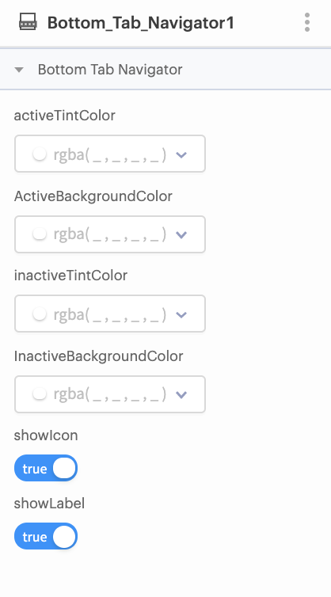

# Bottom Tab Navigator

## Video Tutorial

You can watch a video tutorial for using Navigators in your Thunkable app here:



## Adding Navigators

To add a navigator to your app, click **Screens +** at the top of your component tree.   
Select **Add Navigator** and select the Navigator you want to add.

## Tab Navigator Properties

You have many options for styling your Bottom Tab Navigator, such as changing the background color or tint color. Here are the different options for customization:

#### **Simple Properties**

* **Active Tint Color:** Select a font color for the tab currently in use.
* **Active Background Color:** Select a color for the tab currently in use.
* **Inactive Tint Color:** Select a color for the text of the tabs that are not in use. 
* **Inactive Background Color:** Select a color for the tab not currently in use.
* **ShowIcon:** Toggle whether to show icons in the Tab Navigator.
* **ShowLabel:** Toggle whether to show tab labels in the Tab Navigator.
* **Adding Labels and Icons to Your Tab**

When designing a tab, you can use words or images to guide users to different screens.  

## Screen-Specific Tab Navigator Properties

There are some Tab Navigator properties that are specific to each Screen in your Navigator, such as Tab Label and Tab Icon.

When you add a Screen to your Tab Navigator, you will a new section called **Tab Navigation Options** in your Screen's Properties panel with the following properties:

**Tab Bar Label:** Set the Label of this Screen's tab in the Tab Navigator  
**Active Tab Icon:** Set the Icon of this Screen's tab in the Tab Navigator for when the Screen is active  
**Inactive Tab Icon:** Set the Icon of this Screen's tab in the Tab Navigator for when the Screen is inactive  
**Tab Bar Visible:** Set whether the Tab Navigator is visible when this Screen is open

