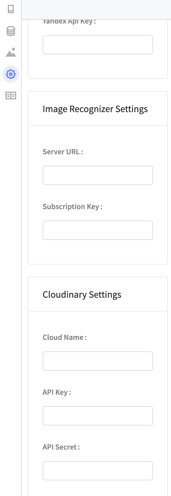

# Camera

You can find the Camera blocks in the Camera drawer of blocks.

For each block in this drawer, you can right-click the block and select **Show advanced block** to see an expanded block with additional outputs. Both the simple and advanced blocks will be explained in this document.

## Use Photo from Camera

This block will open the camera and allow the user to take a photo. The photo can then be used in the app.

### Advanced Block

| Output Name | Data Type | Function |
| :--- | :--- | :--- |
| photo | image | if a photo was taken, returns the photo |
| was cancelled | true/false | returns whether the user cancelled taking the photo |
| error | text | if there was an error, returns the error |

## Use Image from Photo Library

This block will open the user's photo library and allow the user to select a photo. The photo can then be used in the app.

### Advanced Block

| Output | Data Type | Function |
| :--- | :--- | :--- |
| photo | image | if a photo was taken, returns the photo |
| was cancelled | true/false | returns whether the user cancelled selecting a photo |
| error | text | if there was an error, returns the error |

## Image Recognition

This block will generate a description of a given image. This block requires internet access.

This component is powered by [Microsoft Azure](https://blogs.microsoft.com/ai/azure-image-captioning/). You can get your own server URL and subscription key for Microsoft Azure [here](https://azure.microsoft.com/en-us/free/). You can add these details to your app in the [Project Settings panel](projects/project-settings.md#api-keys), which you can access by clicking on your app icon.

### Advanced Block

| Output | Data Type | Function |
| :--- | :--- | :--- |
| description | text | description of the image |
| tags | list of text | returns tags used to identify the image |
| confidence level | number between 0 and 1 | returns calculated confidence level that given description is accurate |
| error | text | if there was an error, returns the error |

## Barcode/QR Code scanner

This block will scan a barcode or a QR code and return its value.

### Advanced Block

| Output | Data Type | Function |
| :--- | :--- | :--- |
| value | text | value of scanned barcode/QR code |
| type | text | returns whether bar code or QR code was scanned |
| was cancelled | true/false | returns whether the user cancelled scanning a code |
| error | text | if there was an error, returns the error |

## Upload image to the cloud

This block will upload an image to Cloudinary and return a URL of the newly uploaded image.

### Advanced block

| Output | Data Type | Function |
| :--- | :--- | :--- |
| URL | text | returns a URL for the uploaded image |
| error | text | if there was an error, returns the error |

### Connecting Your Cloudinary DB to Your Thunkable project

No set up is required but creating your free Cloudinary account is highly recommended. Thunkable provides its own subscription key for your convenience but we strongly recommend creating your own account to ensure privacy for your uploaded media. We also have a current media size limit of 10MB per app and we may periodically clean out our default Cloudinary account

#### Create a [free Cloudinary](https://cloudinary.com/) account

#### Connect your Cloudinary cloud to Thunkable

To connect your Cloudinary cloud to Thunkable, simply retrieve the following fields from the Cloudinary dashboard: `Cloud name`, `API key`, and `API secret.` You can add these details to your app in the [Project Settings panel](projects/project-settings.md#api-keys).

