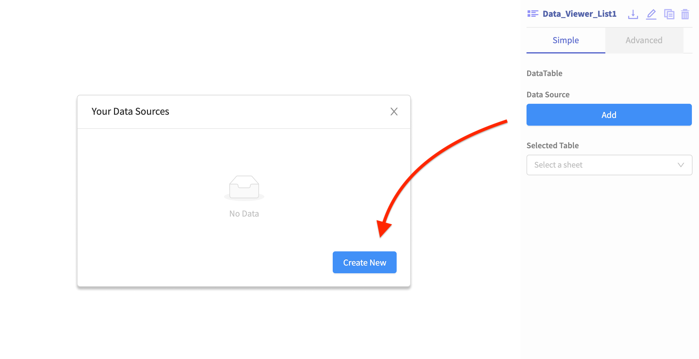
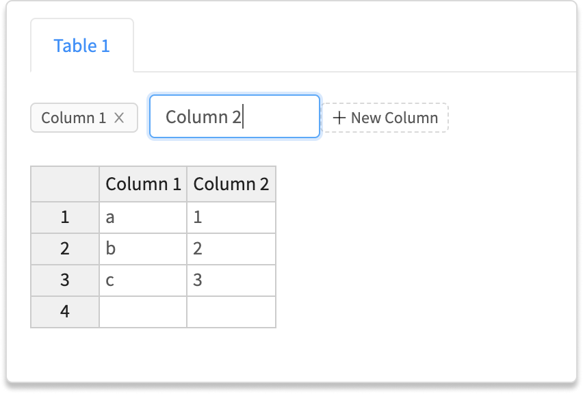
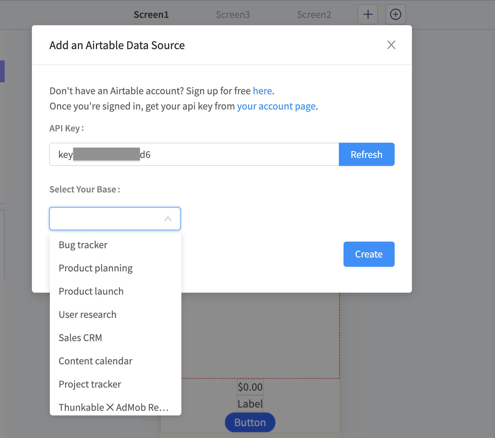
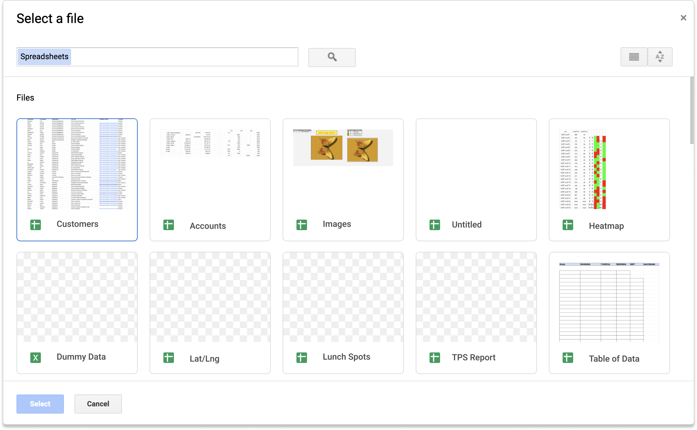
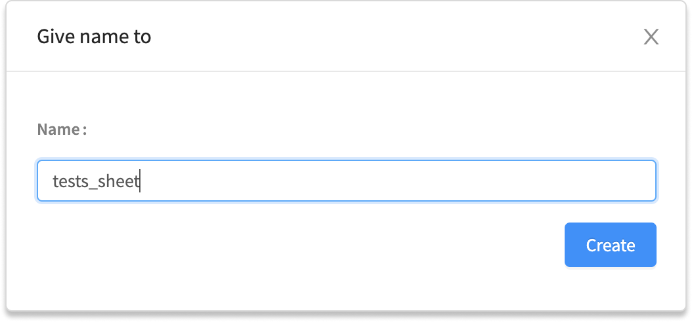
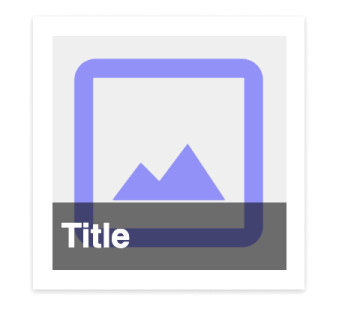
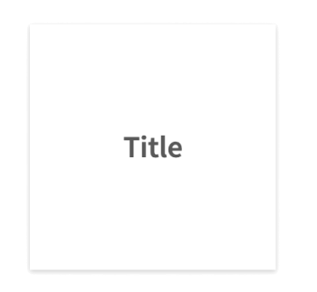
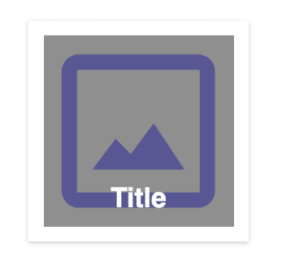
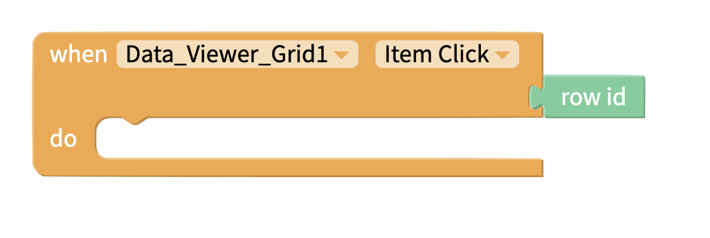

# Data Viewer Grid

## Video Tutorial



## Sample App

Check out our Hockey teams [sample app](https://bit.ly/35JQF7a) to see the Data Viewer grid in action. Click the "Copy Project" button is you'd like to reuse this open-source sample for yourself. 


If you have any feedback for us about the Data Viewer components please let us know over in the [Thunkable Community](https://community.thunkable.com/t/latest-thunkable-release-new-components-data-viewer-list-and-data-viewer-grid-2020-05-05/564204?u=domhnallohanlon).


## Overview

The data viewer components allow you to create beautiful user interfaces for your data. All of this is done in just 3 steps, no blocks required!

1. [Pick your Data Source](data-viewer-grid.md#data-source)
2. [Choose your Item Layout](data-viewer-grid.md#layout)
3. [Set your Data Bindings](data-viewer-grid.md#data-bindings)

You can add additional functionality to the Data Viewer Grid by using the included [component blocks](data-viewer-grid.md#blocks) or you can work directly with your raw data by using the [Data Sources blocks](data-sources.md).

## Data Source

To begin using the Data Viewer you need to specify where your data are stored. Thunkable gives you three different storage options. 

You can use [Google Sheets](data-viewer-list.md#google-sheets) or [Airtable](data-viewer-list.md#airtable) to store data in the cloud. Alternatively, you can [create your own table](data-viewer-list.md#create-your-own-table). This is ideal if you want local, offline access to your data. Creating your own table is also the fastest and easiest way to get started with the data viewer.

In the Data\_Viewer\_List component properties, click the `Add` button. In the pop-up modal you can choose an existing data source. If this is your first time using the Data Viewer you can create a new one by clicking on the `Create New` button.

In the next modal, choose between [Create your own table](data-viewer-list.md#create-your-own-table), [Airtable](data-viewer-list.md#airtable) or [Google Sheets](data-viewer-list.md#google-sheets) as the source of your data.

Please note that some users have reported issues connecting to Google Sheets if they are using G Suite for Education accounts. The quickest way around this, for now, is to user a personal Gmail account. If you need a large group or class to use this feature then you may need to contact your G Suite administrator to review your security settings. 

### Create your Own Table

Start by naming your data source.

Next, select the Data Viewer component and click on the link that says `Click here to edit the data`. This allows you to edit the placeholder data that was automatically generated

The data editor allows you to edit, add, and delete columns of information. To change any of the individual values simply click on the cell and type whatever you like. 

### Airtable 

In Airtable, a base in considered to be the data source. Adding an [Airtable](spreadsheet.md) is really simple. 

To start, copy your API key from your Airtable [account page](https://airtable.com/account). An Airtable API key is a 14 character code that begins with the three letters "key". Paste this key into Thunkable and click the `Refresh` button to see a list of your Airtable bases. 

Choose the base you want to use as your data source and click `Create`.

If you're new to Airtable you can read more about it in our [Airtable](spreadsheet.md) documentation. 

### Google Sheets

In Google Sheets, the entire document is considered to be the data source.


In order to use Google Sheets, the first row in your Sheet must be a header row. 


To connect a Google Sheet, sign in and grant permission for your Thunkable project to access your Google Drive.

Once you have allowed this, you will see a list of spreadsheets in your Google Drive. If you don't seen the sheet you are looking for you can switch to list view, sort alphabetically or search for the one you need. Click `Select` to return to your Thunkable project.

Finally, give you data source a name and you're ready to go. 

## Layouts

### Image with partial Title overlay 

### Title only

### Image Title Subtitle \(Left Aligned\)

### Image and Title

### Image Title Subtitle \(Centre Aligned\)

### Circular Image Title Subtitle

### Image with Title overlay

## Data Bindings

Finally, you need to manually specify which columns in your data source correspond with which placeholders in your chosen layout. Each layout will have its own specific set of data bindings.

For example, if you use the "[Title only](data-viewer-grid.md#title-only)" layout, you will only have one data binding, the Title property.

## Blocks

### Click

The `Item Click` event is fired when any card in the Data Viewer is clicked. It returns a `row id` which corresponds to the unique Thunkable Id of the card that was clicked. The row id is particularly useful when used with the the [Data Source](data-sources.md) blocks.

### Height & Width

The following blocks allow you to work with the height and width properties of the Data Viewer.

### Visible

The entire Data Viewer can be completely hidden or shown by setting the `Visible`property to false or true, respectively. 

### Refresh

Refresh the Data Viewer Grid to sync with the Data Source.

### Data Sources

When you connect a Data Source to your project you will also have access to a second block drawer. These Data Source blocks allow you to perform a variety of CRUD \(**C**reate, **R**ead, **U**pdate, **D**elete\) operations on your data. 

Click on the link below to learn how to use the Data Sources blocks in your project. 



