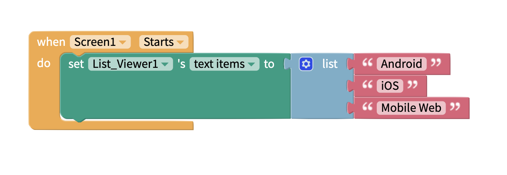
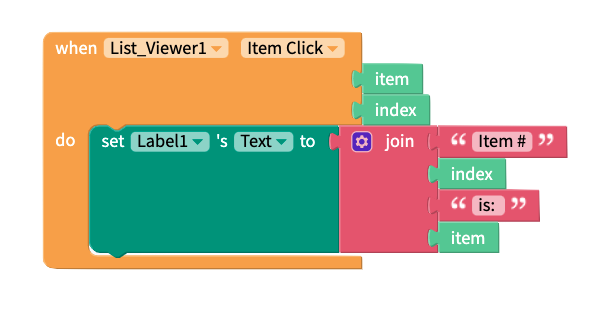

# List Viewer

* [Add items to a List Viewer](list-viewer.md#add-items-to-a-list-viewer)
* [Select item from a List Viewer](list-viewer.md#select-item-from-a-list-viewer)
* [Style the List Viewer](list-viewer.md#style-the-list-viewer)
* [Edit the List Viewer height](list-viewer.md#edit-the-listviewer-height)
* [Add spacing](list-viewer.md#add-spacing)

## Add Items to a List Viewer

### Short Lists

We recommend adding a short [list](lists.md) of items within the app itself as the Screen starts. Although the list block itself can handle a large number of items, practically speaking you probably only want to use this approach if your project has tens of items.

### Medium Lists

If you need longer lists of information in your app you can use delimited data. This is very similar to using something like a .csv file. You can have hundreds of items in your list viewer using this method. 

### Long Lists

For longer lists where you need hundreds or thousands of items in your list, we recommend using the [Data Sources](data-sources.md) component. This gives you three different options for storing your data. 

1. Local Table
2. Airtable
3. Google Sheets

Choosing Airtable or Google Sheets allows you to create dynamic list viewers. This is where the information displayed to the user changes whenever you change your cloud-based data in Airtable or Google Sheets. Either of these options are ideal for when you need to store thousands of items, or you need to work with items that change frequently. 

| Property | Description |
| :--- | :--- |
| Text Items | Default \(`none`\); items must be in list format |

## Select Item from a List Viewer

| Property | Description |
| :--- | :--- |
| Item Click | Returns an `item` value and a numeric `index` number when an item is selected |

## Style the List Viewer

You can customize the List Viewer with the following properties:

* **Show Arrow:** To see an arrow beside each item in the list, set the switch to true
* **Visible:** To see the text input in your app, set the switch to true
* **Border**
  * **Width:** Enter how wide you want the border outline of the List Viewer to be
  * **Color:** Pick a color for the border of the List Viewer
  * **Style:** Select if you want the border to be a dotted, dashed or solid line
  * **Radius:** Enter how round you want the edges of the border for the List Viewer to be
* **Background Colour \(Advanced\):** Sets the background color of the List Viewer

## Edit the ListViewer Height

A List Viewer automatically fill 100% of the Screen width

You can set how tall the List Viewer is using the height property.

**Height**

* **Fill container -** The List Viewer fills the entire screen vertically
* **Fit contents -** The List Viewer’s height changes to fit the contents it contains
* **Relative size -** The List Viewer fills the specified percentage of the screen
* **Absolute size -** Sizes the List Viewer to a specified number of pixels

## Add Spacing

You change the spacing and positioning of the List Viewer with the Margin and Padding properties.

**Margin**

* You can specify how much space you want between the border and the contents of List Viewer using either pixel or percent values.

**Padding**

* You can specify how much space you want between the edges of the List Viewer and the screen using either pixel or percent values.

## Events

Performs an action when the user clicks on any one of the list items.

## Properties

### Height

The set and get height blocks work with the Height property of the list viewer component. Acceptable input values are. 

* Number of Pixels
* Percentage Height
* "Fit Contents"
* "Fill Container"

The `Computed Height`block returns the on-screen dimensions of the list viewer, after it has been rendered on-screen. The value returned is an integer, representing the size of the button in pixels.

### Show Arrow

Choose whether or not the arrow is displayed next to every item in the list viewer.

### Text Items

Set or get the list of text items that are displayed in the List Viewer. You must use a [list](lists.md) of data here - either locally stored or stored in the cloud.

### Visible

The set and get visible blocks are used to show or hide the entire list viewer component. Acceptable values are:

* True
* False

### Width

The `Computed Width`block returns the on-screen dimensions of the button, after it has been rendered on-screen. The value returned is an integer, representing the size of the button in pixels.

The list viewer doesn't currently support pixel or percentage values for the `width` property.

