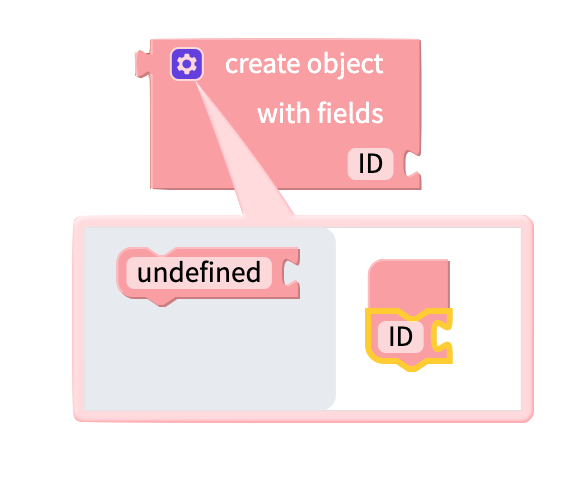
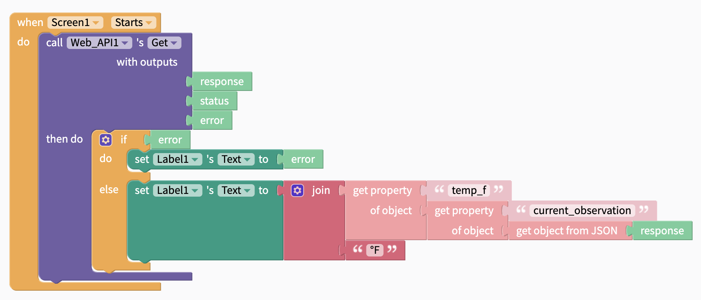

# Objects

The Object blocks pair well with the [Web API](web-api.md), [Map](map.md) and [Location Sensor](location-sensor.md) components which often send data in object format. The [Spreadsheet]() component also requires data to be in object format for it to upload successfully as a row

## Creating an Object

### Create a New Object

You can use the following block to create a new object. Objects can be uploaded to your [Firebase DB]() as the value of a [cloud variable](variables.md#cloud-variables), or they can be uploaded to an [Airtable DB]() as a row object.

You can click on the gear icon to add properties to your object:

### Convert between Object and JSON

Sometimes, you want to convert between JSON \(JavaScript Object Notation\) and Objects. If an [API](web-api.md) returns a JSON value, you can convert it to an Object to use with Object blocks. Use the `get object from JSON` block:

Similarly, you may want to convert an Object to JSON to make an API POST, or set headers or query parameters for your API call. You can do this with the `generate JSON from Object` block: 

## Reading Property Values of an Object

### Get Values of an Object

You can use the `get property` block to read the value of an object's property.  
If the object does not have a property with this name, it will return `undefined`.

### Get Properties of an Object

You can use the `get Object properties of` block to return the names of the properties of an object.

This block returns a list of property names. This list can be used with [list](lists.md) blocks.

## Set Property Values of an Object

With the `set property` block, you can change the value of a single property of an object.

## Examples of using Object blocks in your app

### Getting values from an API

You can use Object blocks when making calls to an[ API.](web-api.md)

Often, when retrieving data from an API like [Weather Underground](https://www.wunderground.com/weather/api/d/docs?MR=1), you will get a large data dump in JSON format like shown below.

`{ "response": { "version": "0.1", "termsofService": "http://www.wunderground.com/weather/api/d/terms.html", "features": { "conditions": 1 } }, "current_observation": { "image": { "url": "http://icons-ak.wxug.com/graphics/wu2/logo_130x80.png", "title": "Weather Underground", "link": "http://www.wunderground.com" }, "display_location": { "full": "San Francisco, CA", "city": "San Francisco", "state": "CA", "state_name": "California", "country": "US", "country_iso3166": "US", "zip": "94101", "latitude": "37.77500916", "longitude": "-122.41825867", "elevation": "47.00000000" }, "observation_location": { "full": "SOMA - Near Van Ness, San Francisco, California", "city": "SOMA - Near Van Ness, San Francisco", "state": "California", "country": "US", "country_iso3166": "US", "latitude": "37.773285", "longitude": "-122.417725", "elevation": "49 ft" }, "estimated": {}, "station_id": "KCASANFR58", "observation_time": "Last Updated on June 27, 5:27 PM PDT", "observation_time_rfc822": "Wed, 27 Jun 2012 17:27:13 -0700", "observation_epoch": "1340843233", "local_time_rfc822": "Wed, 27 Jun 2012 17:27:14 -0700", "local_epoch": "1340843234", "local_tz_short": "PDT", "local_tz_long": "America/Los_Angeles", "local_tz_offset": "-0700", "weather": "Partly Cloudy", "temperature_string": "66.3 F (19.1 C)", "temp_f": 66.3, "temp_c": 19.1, "relative_humidity": "65%", "wind_string": "From the NNW at 22.0 MPH Gusting to 28.0 MPH", "wind_dir": "NNW", "wind_degrees": 346, "wind_mph": 22.0, "wind_gust_mph": "28.0", "wind_kph": 35.4, "wind_gust_kph": "45.1", "pressure_mb": "1013", "pressure_in": "29.93", "pressure_trend": "+", "dewpoint_string": "54 F (12 C)", "dewpoint_f": 54, "dewpoint_c": 12, "heat_index_string": "NA", "heat_index_f": "NA", "heat_index_c": "NA", "windchill_string": "NA", "windchill_f": "NA", "windchill_c": "NA", "feelslike_string": "66.3 F (19.1 C)", "feelslike_f": "66.3", "feelslike_c": "19.1", "visibility_mi": "10.0", "visibility_km": "16.1", "solarradiation": "", "UV": "5", "precip_1hr_string": "0.00 in ( 0 mm)", "precip_1hr_in": "0.00", "precip_1hr_metric": " 0", "precip_today_string": "0.00 in (0 mm)", "precip_today_in": "0.00", "precip_today_metric": "0", "icon": "partlycloudy", "icon_url": "http://icons-ak.wxug.com/i/c/k/partlycloudy.gif", "forecast_url": "http://www.wunderground.com/US/CA/San_Francisco.html", "history_url": "http://www.wunderground.com/history/airport/KCASANFR58/2012/6/27/DailyHistory.html", "ob_url": "http://www.wunderground.com/cgi-bin/findweather/getForecast?query=37.773285,-122.417725" } }`

You may just want to pull out one attribute \(like temp\_f or the temperature in Farenheit\). To do so, you'll need to use the object blocks below:

