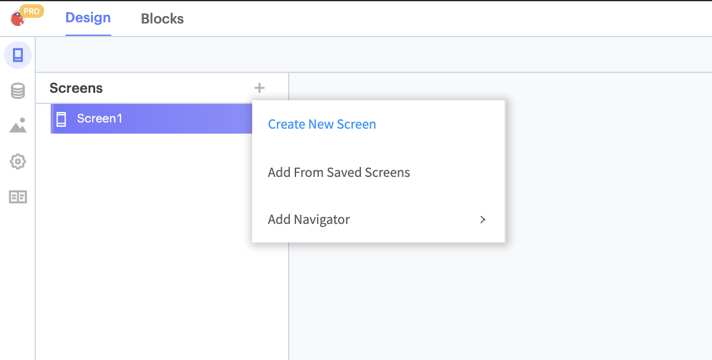
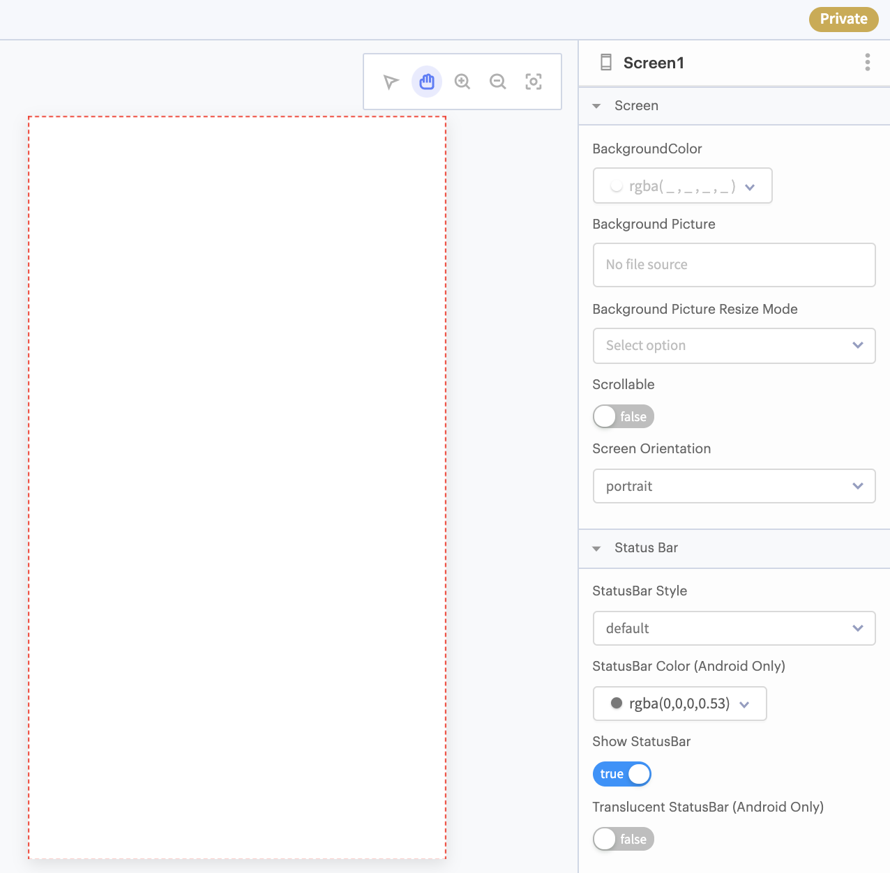
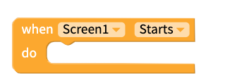

# Screen

## Adding a Screen to your Project

There are two ways to add a new screen to your app:

Click the + icon next to your Screen names in the Screens bar.

Click **Screens +** at the top of your component tree.   
Select **Create New Screen.**

### Add a Background Color or Picture

| Property | Description |
| :--- | :--- |
| Background Color | Default \(`none`\). Select any color using the color picker, RGBA or HEX value |
| Background Picture | You can upload a background image to your app or reference an image url e.g.`beaver-yellow.png` |

#### Background Picture Resize Mode

This determines how to resize the image when the frame doesn't match the raw image dimensions.

* Cover: Fills the entire screen without changing the height and width ratio of the image 
* Contain: The entire image will be scaled down to fit inside the screen, without changing the height and width ratio of the image 
* Stretch: The image's height will change to fill the screen length-wise 
* Repeat: Repeat the image to cover the screen. The image's height and width ratio

   will not change    

* Center: Positions the image in the middle of the frame

### Enable Scrolling

| Property | Description |
| :--- | :--- |
| Scrollable | Default \(`false`\). Indicates whether the screen is scrollable. For scrollable to work, the components in your screen must have heights either set in `absolute` pixels or set to `fit contents` |

### Set Orientation

| Property | Description |
| :--- | :--- |
| Screen Orientation | Default \(`all`\). You can fix the screen orientation to `portrait` and `landscape` |

## Status Bar

### Hide \(or show\) Status Bar

| Property | Description |
| :--- | :--- |
| Show StatusBar | Default \(`true`\). If set to `false`, hides the top status bar |

### Status Bar Theme

| Property | Description |
| :--- | :--- |
| StatusBar Style | Choose between `default` , `light-content` or `dark-content` to set the theme or style of the status bar |

### Status Bar Opacity


Please Note: The `Translucent StatusBar` property will only work on Android devices at this time.


| Property | Description |
| :--- | :--- |
| Translucent StatusBar  | Default \(`false`\). Set to `true` to make the Status Bar translucent.  Android-only. |

### Status Bar Color


Please Note: The `StatusBar Color`property will only work on Android devices at this time.


| Property | Description |
| :--- | :--- |
| StatusBar Color | Default \(`0,0,0,0.53`\). Select any color using the color picker, RGBA or HEX value. Android-only. |

## Screen Blocks 

### when Screen1 Starts

| Event | Description |
| :--- | :--- |
| Starts | Fires when the Screen is **first** opened |

### when Screen1 Opens

| Event | Description |
| :--- | :--- |
| Opens | Fires **anytime** the Screen is opened |

### when Screen1 BackButtonPressed

| Event | Description |
| :--- | :--- |
| BackButtonPressed | Fires when the physical or on-screen back button is pressed. \(Android only\) |

### in Screen1 call ToggleDrawerMenu

| Function | Description |
| :--- | :--- |
| ToggleDrawerMenu | Opens or Closes the drawer menu, if available. Must be used in conjunction with the [Drawer Navigator](drawer-navigator.md) |

