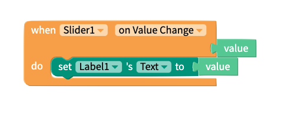

# Slider

## Slider Overview

* [Getting Started](slider.md#getting-started)
* [Style the Slider](slider.md#style-the-slider)
* [Add Spacing](slider.md#add-spacing)
* [Events](slider.md#events) 
* [Properties](slider.md#properties)

The Slider is a great UI element to enable users easily select a value from a fixed range of values.

## 

## Getting Started

To set up a slider, you'll have to first define the `minimum` and `maximum` values, the initial `value` and the incremental `steps` of the slider

We recommend using a Label with the Slider so that users can get immediate feedback on the value being set.

| Property | Description |
| :--- | :--- |
| Minimum Value | Default \(`0`\); Minimum and leftmost value of the Slider |
| Maximum Value | Default \(`100`\); Maximum and rightmost value of the Slide |
| Value | Default \(`0`\); Initial value of the Slider |
| Step | Default \(`0`\); Increments of the Slider |

## Style the Slider

* **Minimum Track Tint Color:** Color of the slider track to the left of the thumb
* **Maximum Track Tint Color:** Color of the slider track to the right of the thumb
* **Thumb Tint Color \(Android only\):** Color of the thumb
* **Border:** 
  * **Width:** Enter how wide you want the border outline of the Slider to be
  * **Color:** Pick a color for the border of the Slider
  * **Style:** Select if you want the border to be a dotted, dashed or solid line
  * **Radius:** Enter how round you want the edges of the border for the Slider to be

| Property | Description |
| :--- | :--- |
| Minimum Track Tint Color | Default \(`none`\); Color of the slider track to the left of the thumb |
| Maximum Track Tint Color | Default \(`none`\); Color of the slider track to the right of the thumb |
| Thumb Tint Color \(Android only\) | Default \(`none`\); Color of the thumb |
| Border | Default \(`none`\); You can add a border with customized `width`, `color`, `style (solid, dotted, dashed)`and `borderRadius` |

## Edit size and position

You can drag and drop your component into position, and set its size.   
You can set exact values for the component's Height and Width, and X and Y coordinates, in its properties.

**Height:** Height of Button in pixels  
**Width:** Width of Button in pixels

**X:** position of top left corner of Button on X-axis  
**Y:** position of top right corner of component on Y-axis

## Events 

### On Sliding Complete

When the user takes their finger off the slider. The event returns the value that the slider has settled on.

Please note that the `on Sliding Complete`  event does not work in web preview

### On Value Change

This event fires each time the slider moves to a new position. Each time a new values is selected this event will return an updated value.

## Properties

### Disabled 

### Height 

The set and get height blocks work with the Height property of the slider component. Acceptable input values are. 

* Number of Pixels
* Percentage Height
* "Fit Contents"
* "Fill Container"

The `Computed Height`block returns the on-screen dimensions of the slider, after it has been rendered on-screen. The value returned is an integer, representing the size of the slider in pixels.

### Maximum Track Tint Color

###  

Set or get the color of the right side of the slider.

### Maximum Value

Set or get the biggest value of the slider

### Minimum Track Tint Color 

Set or get the color of the left side of the slider

### Minimum Value

Set or get the smallest value of the slider

### Step 

Set or get the step-size, also known as the increment, of the slider.

### Thumb Tint Color 

Change the color of the slider itself.

### Value 

The set and get value blocks are user to work with the position of the slider.

### Visible 

The set and get visible blocks are used to show or hide the entire Slider component. Acceptable values are:

* True
* False

### Width

The set and get width blocks work with the Width property of the Slider component. Acceptable input values are. 

* Number of Pixels
* Percentage Height
* "Fit Contents"
* "Fill Container"

The `Computed Width`block returns the on-screen dimensions of the slider, after it has been rendered on-screen. The value returned is an integer, representing the size of the slider in pixels.

