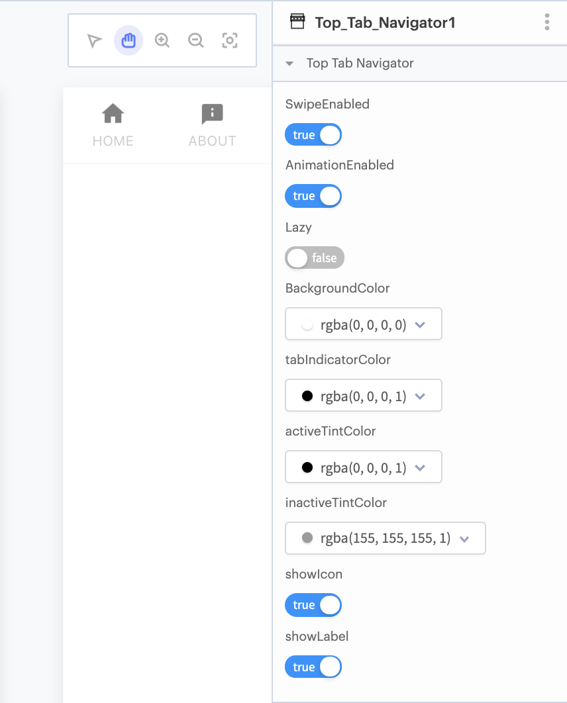

# Top Tab Navigator

The Top Tab Navigator is positioned at the top of your app, and allows users to switch between different screens by clicking. 

## Video Tutorial

You can watch a video tutorial that explains all of the Navigators here:



## Adding Navigators

To add a navigator to your app, click **Screens +** at the top of your component tree.   
Select **Add Navigator** and select the Navigator you want to add.

## Tab Navigator Properties

You have many options for styling your Top Tab Navigator, such as changing the background color or tint color. Here are the different options for customization:

#### Simple Properties

* **SwipeEnabled:** Allow the user to swipe between screens.
* **AnimationEnabled:** Select whether to animate the transitions between screens.
* **Lazy:** If `true`, tabs are only loaded once the tab is opened. If `false`, all tabs are loaded when the Tab Navigator is first opened.
* **Background Color:** Select a color for the top tab navigator. 
* **Tab Indicator Color:** An underline will appear underneath the tab you select. You can select a color for the underline. 
* **Active Tint Color:** Select a font color for the tab currently in use.
* **Inactive Tint Color:** Select a color for the text of the tabs that are not in use. 
* **ShowIcon:** Toggle whether to show icons in the Tab Navigator.
* **ShowLabel:** Toggle whether to show tab labels in the Tab Navigator.

#### Advanced Properties

* **Upper Case Label:** Make the text for all the tabs upper case. 
* **PressColor:** Color of material ripple as a tab is pressed
* **PressOpacity:** Opacity of material ripple as a tab is pressed
* **ScrollEnabled:** Toggle whether to enable scrollable tabs
* **Tab Indicator Height:** An underline will appear underneath the tab you select. This section will allow you to choose how tall the underline is.

## Adding Labels and Icons to Your Tabs 

When designing a tab, you can use words or images to guide users to different screens. 

## Properties

**SwipeEnabled:** Let the user swipe between screens  
**AnimationEnabled:** show a smooth transition animation between screens  
**Lazy:** If true, only loads the screen the user has open at a time. If false, loads all screens when the Navigator is opened.   
**BackgroundColor:** Set background Color  
**tabIndicatorColor:** Set color of the line that displays beneath your active tab  
**activeTintColor:** Set color of the tab you are currently viewing  
**inactiveTintColor:** Set color of the tabs you are not currently viewing  
**showIcon:** Show tab Icons in Navigator  
**showLabel:** Show tab Labels in Navigator

## Screen-Specific Tab Navigator Properties

There are some Tab Navigator properties that are specific to each Screen in your Navigator, such as Tab Label and Tab Icon.

When you add a Screen to your Tab Navigator, you will a new section called **Tab Navigation Options** in your Screen's Properties panel with the following properties:

**Tab Bar Label:** Set the Label of this Screen's tab in the Tab Navigator  
**Active Tab Icon:** Set the Icon of this Screen's tab in the Tab Navigator for when the Screen is active  
**Inactive Tab Icon:** Set the Icon of this Screen's tab in the Tab Navigator for when the Screen is inactive  
**Tab Bar Visible:** Set whether the Tab Navigator is visible when this Screen is open

